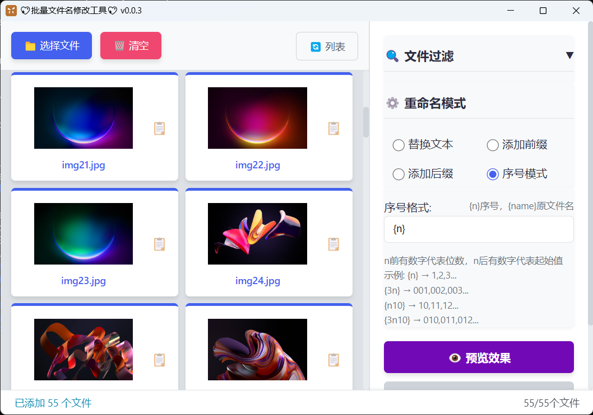

# VF 文件批量重命名工具使用指南

*新版本v0.0.7 文件列表默认按文件夹+文件名排序*

本文档详细介绍了如何使用 VF 文件批量重命名工具的各种功能。

## 目录

1. [界面介绍](#界面介绍)
2. [添加文件](#添加文件)
3. [文件过滤](#文件过滤)
4. [拖拽排序](#拖拽排序)
5. [重命名模式](#重命名模式)
   - [文本替换](#文本替换)
   - [添加前缀](#添加前缀)
   - [添加后缀](#添加后缀)
   - [序号模式](#序号模式)
   - [改扩展名](#改扩展名)
6. [预览和应用](#预览和应用)
7. [撤销操作](#撤销操作)
8. [使用技巧](#使用技巧)

## 界面介绍

VF 工具界面分为三个主要区域：

1. **文件列表区域**（左侧）：显示已添加的文件列表
2. **控制面板区域**（右侧）：包含所有操作选项
3. **状态栏**（底部）：显示当前状态和文件统计信息

## 添加文件

有两种方式向工具中添加文件：

### 方式一：选择文件按钮

1. 点击左上角的「📁 选择文件」按钮
2. 在弹出的文件选择对话框中选择一个或多个文件
3. 点击「打开」按钮确认选择

### 方式二：拖拽文件

1. 在文件资源管理器中选择一个或多个文件
2. 将文件拖拽到左侧文件列表区域
3. 文件将自动添加到列表中

> **提示**：重复添加的文件会被自动过滤，不会重复出现在列表中。

## 文件过滤

文件过滤功能允许您只对特定类型的文件进行重命名操作。

### 设置过滤条件

1. 在右侧「🔍 文件过滤」区域的输入框中输入需要处理的文件扩展名
2. 在"关键词过滤"输入框中输入文件名关键词
3. 多个扩展名请用英文逗号分隔，例如：`jpg,png,gif,txt`
4. 不需要在扩展名前添加点号（.），程序会自动处理

### 选择过滤模式

对于扩展名和关键词过滤，您可以选择两种模式：

1. **包含模式**：只处理包含指定扩展名或关键词的文件
2. **不包含模式**：只处理不包含指定扩展名或关键词的文件

### 应用过滤

1. 点击「应用查看」按钮应用过滤条件
2. 不符合条件的文件会变灰并标记为"已过滤"
3. 后续的重命名操作只会对未过滤的文件生效

### 重置过滤

1. 点击「🔄 重置」按钮清除所有过滤条件
2. 所有文件将恢复为可操作状态

## 拖拽排序

拖拽排序功能允许您自定义文件的处理顺序，特别适用于序号模式。

### 调整文件顺序

1. 在文件列表中，将鼠标悬停在要移动的文件上
2. 按住鼠标左键拖拽文件到目标位置
3. 松开鼠标左键完成排序

### 与过滤功能配合使用

1. 拖拽排序功能与过滤功能完全兼容
2. 在过滤状态下拖拽文件，排序顺序会被正确保存
3. 序号模式将按照拖拽后的顺序生成序号

## 重命名模式

VF 工具提供五种重命名模式，可通过单选按钮在「⚙️ 重命名模式」区域中选择。

### 文本替换

此模式用于在文件名中查找并替换指定文本。

**使用步骤**：
1. 选择「替换文本」单选按钮
2. 在「查找内容」输入框中输入需要被替换的文本
3. 在「替换为」输入框中输入替换后的文本
4. 点击「👁️ 预览效果」查看结果

**示例**：
- 原文件名：`IMG_2023_photo.jpg`
- 查找内容：`IMG_2023`
- 替换为：`Vacation_2023`
- 结果：`Vacation_2023_photo.jpg`

### 添加前缀

此模式用于在所有文件名前添加指定前缀。

**使用步骤**：
1. 选择「添加前缀」单选按钮
2. 在「前缀」输入框中输入要添加的前缀
3. 点击「👁️ 预览效果」查看结果

**示例**：
- 原文件名：`photo.jpg`
- 前缀：`New_`
- 结果：`New_photo.jpg`

### 添加后缀

此模式用于在所有文件名后添加指定后缀（在扩展名之前）。

**使用步骤**：
1. 选择「添加后缀」单选按钮
2. 在「后缀」输入框中输入要添加的后缀
3. 点击「👁️ 预览效果」查看结果

**示例**：
- 原文件名：`photo.jpg`
- 后缀：`_edited`
- 结果：`photo_edited.jpg`

### 序号模式

此模式用于按顺序编号重命名文件。

**使用步骤**：
1. 选择「序号模式」单选按钮
2. 在「序号格式」输入框中输入格式字符串
3. 点击「👁️ 预览效果」查看结果

**可用占位符**：
- `{n}`：序号（从1开始）
- `{2n}`：两位数序号（从01开始）
- `{3n}`：三位数序号（从001开始）
- `{n5}`：从5开始的序号
- `{n10}`：从10开始的序号
- `{3n100}`：三位数序号从100开始（即从100, 101, 102...显示为100, 101, 102）
- `{5n100}`：五位数序号从100开始（即从100, 101, 102...显示为00100, 00101, 00102）
- `{name}`：原文件名（不含扩展名）
- `{ext}`：文件扩展名

**示例**：
- 序号格式：`File_{n}_{name}` 重命名后为 `File_1_filename.txt`
- 序号格式：`File_{2n}_{name}` 重命名后为 `File_01_filename.txt`
- 序号格式：`File_{3n}_{name}` 重命名后为 `File_001_filename.txt`
- 序号格式：`File_{n5}_{name}` 重命名后为 `File_5_filename.txt`
- 序号格式：`File_{n10}_{name}` 重命名后为 `File_10_filename.txt`
- 序号格式：`File_{3n100}_{name}` 重命名后为 `File_100_filename.txt`
- 序号格式：`File_{5n100}_{name}` 重命名后为 `File_00100_filename.txt`
- 原文件名：`photo.jpg`, `document.pdf`
- 序号格式：`File_{n}_{name}`
- 结果：`File_1_photo.jpg`, `File_2_document.pdf`

**拖拽排序与序号模式**：
- 序号将按照文件列表的当前顺序生成
- 使用拖拽排序调整文件顺序后，序号将按照新顺序生成
- 这对于需要按特定顺序编号的文件非常有用

### 改扩展名

此模式用于批量更改文件的扩展名。

**使用步骤**：
1. 选择「改扩展名」单选按钮
2. 在「新扩展名」输入框中输入新的扩展名（不需要加点号`.`）
3. 点击「👁️ 预览效果」查看结果

**注意事项**：
- 输入扩展名时不需要加点号（`.`），例如输入`jpg`而不是`.jpg`
- 可以输入空扩展名来移除文件的扩展名
- 程序会自动验证扩展名的有效性，防止输入包含特殊字符的无效扩展名

**示例**：
- 原文件名：`photo.jpg`, `document.png`
- 新扩展名：`webp`
- 结果：`photo.webp`, `document.webp`

**移除扩展名示例**：
- 原文件名：`photo.jpg`, `document.png`
- 新扩展名：（留空）
- 结果：`photo`, `document`

## 预览和应用

在设置好重命名规则后，您可以预览结果并应用更改。

### 预览效果

1. 设置好重命名规则后，点击「👁️ 预览效果」按钮
2. 文件列表中会显示每个文件的原始名称和新名称
3. 原始名称会以删除线形式显示，新名称以粗体显示

### 应用更改

1. 确认预览结果无误后，点击「✅ 应用更改」按钮
2. 程序会执行实际的文件重命名操作
3. 操作完成后，状态栏会显示操作结果

> **注意**：应用更改后，原始文件名将被更新为新文件名，无法通过撤销功能恢复。

### 文件名冲突处理

VF 工具具有智能的文件名冲突处理机制：

1. **文件交换重命名**：支持文件名交换操作（如A重命名为B，B重命名为A）
2. **自动添加后缀**：当目标文件名已存在时，自动添加序号后缀（如pp1.png重命名为pp1(1).png）
3. **界面同步更新**：界面会实时显示实际重命名结果

## 撤销操作

如果对预览结果不满意，可以撤销操作：

1. 点击「↩️ 撤销预览」按钮
2. 文件名将恢复为原始状态
3. 可以重新设置重命名规则

> **提示**：撤销功能只适用于预览状态，一旦点击「应用更改」就无法撤销。

## 使用技巧

### 批量处理特定类型文件

1. 使用文件过滤功能筛选出需要处理的文件类型
2. 设置相应的重命名规则
3. 预览并应用更改

### 清空文件列表

如果需要重新开始，可以点击「🗑️ 清空列表」按钮清除所有已添加的文件。

### 查看操作结果

状态栏会实时显示以下信息：
- 当前操作状态（就绪、处理中等）
- 文件统计信息（总文件数、符合条件的文件数）
- 操作结果提示

### 处理大量文件

当处理大量文件时，建议：
1. 先使用过滤功能筛选出目标文件
2. 先预览效果确认无误
3. 再应用更改

### 组合使用功能

您可以组合使用各种功能：
1. 先过滤出图片文件
2. 使用拖拽排序调整处理顺序
3. 使用序号模式添加编号
4. 再添加前缀或后缀
5. 最后统一修改扩展名格式

### 处理文件名冲突

当遇到文件名冲突时：
1. 系统会自动为冲突文件添加后缀（如picture1(1).png）
2. 界面会实时显示实际重命名结果
3. 无需手动干预，系统会自动处理冲突
